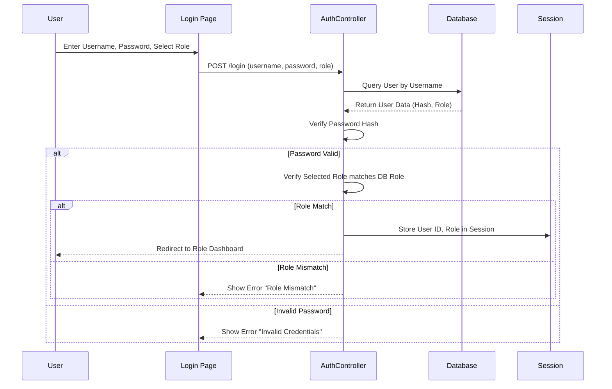
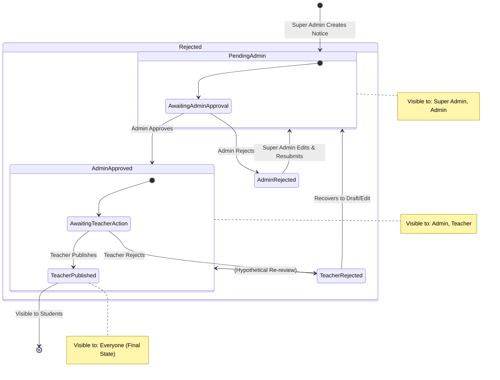
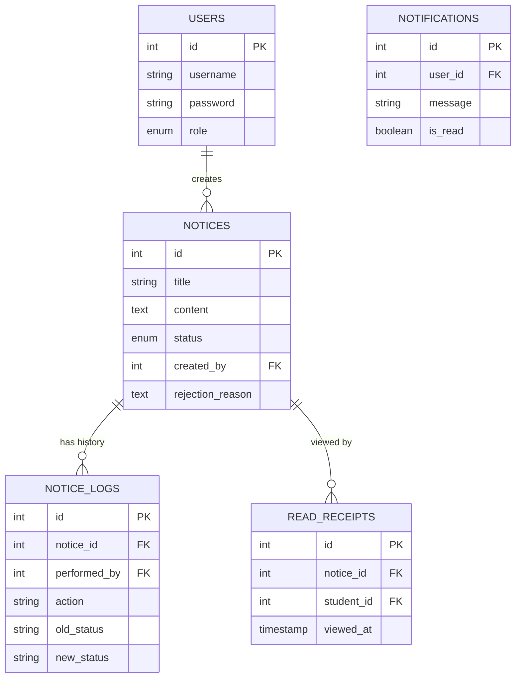

# Role Based Notice System

A PHP-based web application for managing notices with a multi-role approval workflow.

## Features
-   **Multi-Role System**: Super Admin, Admin, Teacher, Student.
-   **Notice Workflow**: Creation -> Admin Approval -> Teacher Publishing -> Student Viewing.
-   **Rejection Handling**: Detailed feedback loops for rejected notices.
-   **Dashboard**: Role-specific dashboards with relevant actions.
-   **Notifications**: Real-time alerts for system events.

## Setup
1.  Import `setup.sql` into your MySQL database.
2.  Configure database credentials in `config/db.php`.
3.  Serve the application via XAMPP/Apache.

## Default Credentials
All users have the password: `password123`

-   **Super Admin**: `superadmin`
-   **Admin**: `admin`
-   **Teacher**: `teacher`
-   **Student**: `student`

---

## System Documentation

### 1. System Overview
The **Role Based Notice System** is a web application designed to manage the lifecycle of notices within an educational institution. It features a multi-tiered approval workflow involving Super Admins, Admins, Teachers, and Students.

### 2. User Roles & Responsibilities

| Role | Access Level | Responsibilities |
| :--- | :--- | :--- |
| **Super Admin** | High | - Create new notices. - Edit rejected notices. - Resubmit notices for approval. - View notice history. |
| **Admin** | Medium | - Review notices created by Super Admin. - Approve notices (moves to Teacher). - Reject notices (returns to Super Admin). |
| **Teacher** | Medium | - Review notices approved by Admin. - Publish notices (visible to Students). - Reject notices (returns to Admin/Super Admin). |
| **Student** | Low | - View published notices. - Mark notices as read (automatically tracked). |

### 3. Authentication Flow
The system uses session-based authentication with role verification.

### 4. Notice Workflow (State Machine)
Notices go through a strict approval pipeline.

#### Detailed Workflow Steps:
1.  **Draft/Creation**: Super Admin creates a notice. Status is set to `pending_admin`.
2.  **Admin Review**: 
    -   If **Approved**: Status becomes `admin_approved`. Notified: Teacher.
    -   If **Rejected**: Status becomes `admin_rejected`. Notified: Super Admin (with reason).
3.  **Teacher Review**:
    -   If **Published**: Status becomes `teacher_published`. Notified: Students.
    -   If **Rejected**: Status becomes `teacher_rejected`. Notified: Admin.
4.  **Resubmission**: Super Admin can edit `admin_rejected` notices, resetting status to `pending_admin`.

### 5. Database Schema
The system maps users, notices, logs, and interaction data.

### 6. Directory Structure
The application follows a simple **MVC (Model-View-Controller)** pattern:

-   `config/`: Database configuration (`db.php`).
-   `public/`: Public entry point (`index.php`) and assets.
-   `src/`: Application source code.
    -   `Controllers/`: Logic for handling requests (`AuthController`, `NoticeController`, `DashboardController`).
    -   `Models/`: Database interactions (`User`, `Notice`, `Notification`, `Log`).
    -   `Views/`: HTML templates.
        -   `auth/`: Login pages.
        -   `dashboard/`: Role-specific dashboards.
        -   `layouts/`: Shared header/footer.
        -   `notices/`: Forms for creating/editing notices.
-   `setup.sql`: Database initialization script.
